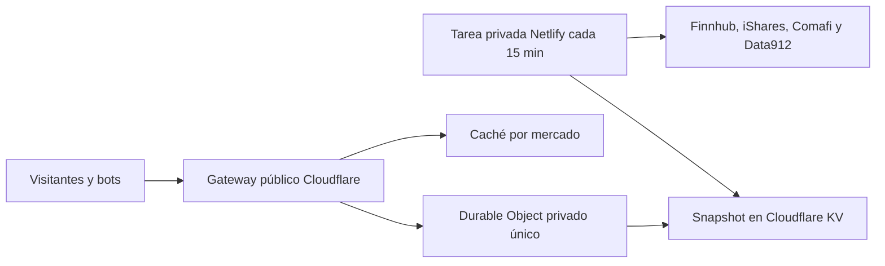

# Despliegue de cotizaciones



El Worker público solo lee datos. No tiene tokens de Finnhub o de la API de administración de Cloudflare. No hay proxy, función pública de Netlify, refresco por petición, método de actualización ni fallback hacia un proveedor. El coordinador solo se alcanza mediante su binding privado.

## 1. Crear almacenamiento en Cloudflare

Usar Workers Free. Los Durable Objects del proyecto usan SQLite, disponible en ese plan. Desde esta carpeta:

```sh
npx wrangler login
npx wrangler kv namespace create RATES_KV
```

Copiar el ID devuelto al campo `kv_namespaces[0].id` de `gateway/wrangler.jsonc`; reemplazar el placeholder antes de desplegar. La tarea privada necesita el mismo ID en `CLOUDFLARE_KV_NAMESPACE_ID` y el ID de la cuenta en `CLOUDFLARE_ACCOUNT_ID`.

Crear un API Token de Cloudflare con permiso `Workers KV Storage: Edit` en la cuenta elegida, para leer y escribir el snapshot. Guardarlo como `CLOUDFLARE_KV_API_TOKEN` exclusivamente en la tarea privada y, si se hará la carga inicial desde la computadora, en `.env`. No usar la Global API Key ni variables `VITE_*` para credenciales.

## 2. Desplegar el gateway

En `gateway/wrangler.jsonc`, mantener `APP_BASE_PATH` igual al prefijo del frontend y configurar `ALLOWED_ORIGIN` con su origen exacto, por ejemplo `https://ezevillo.com`, sin ruta ni barra final. Para una URL nativa de Netlify debe utilizarse ese origen exacto. Los previews con otros orígenes requieren configuración propia; no se permite un comodín.

```sh
npm run gateway:test
npm run gateway:deploy
```

`workers_dev: true` publica únicamente el gateway. `preview_urls: false` evita URLs alternativas de preview. `RatesCoordinator` es una clase privada exportada para el binding, sin un endpoint público. La migración `new_sqlite_classes` crea su almacenamiento; conservar la migración al desplegar versiones posteriores.

La API queda en:

```text
https://ibit-rates-gateway.TU-SUBDOMINIO.workers.dev/ibit-to-btc/api/rates
```

Configurar esa URL completa como `VITE_RATES_API_URL` en el build del frontend. El navegador accede directamente a Cloudflare, sin pasar por Netlify. Puede usarse un dominio propio de Cloudflare; si se cambia la URL, reconstruir el frontend para actualizar también la CSP. Si el sitio principal envía su propia CSP, permitir también el origen exacto del gateway en `connect-src`.

## 3. Cargar el primer snapshot

Completar las variables privadas de `.env` indicadas en `.env.example`. Con una clave Finnhub válida:

```sh
npm run refresh:cloudflare
npm run check:production
```

La primera orden consulta las cuatro fuentes una vez y guarda ambos mercados bajo `rates:v1`, sin expiración automática. La segunda consulta únicamente el gateway y valida los datos guardados. Una carga manual adicional consume una consulta más a cada proveedor; no forma parte del tráfico de visitantes.

## 4. Configurar Netlify

Variables de **Builds**:

| Variable | Valor |
| --- | --- |
| `SITE_URL` | Origen público del frontend |
| `APP_BASE_PATH` | `/ibit-to-btc/` o el prefijo elegido |
| `VITE_RATES_API_URL` | URL HTTPS completa del gateway |

Variables de **Functions**, sin prefijo `VITE_`:

| Variable | Uso |
| --- | --- |
| `FINNHUB_API_KEY` | Consultar únicamente IBIT en Finnhub |
| `CLOUDFLARE_ACCOUNT_ID` | Cuenta del namespace |
| `CLOUDFLARE_KV_NAMESPACE_ID` | Namespace de cotizaciones |
| `CLOUDFLARE_KV_API_TOKEN` | Leer y escribir el snapshot desde la tarea privada |

Publicar este proyecto con `netlify.toml`. En Functions verificar que `refresh-rates` figura como **Scheduled**, con frecuencia `*/15 * * * *`. Netlify usa UTC y permite un máximo de 30 segundos por ejecución; las llamadas tienen timeouts de 5 segundos para KV y 10 segundos para fuentes, consultadas en paralelo. No se reintentan automáticamente.

Si el sitio principal tiene reglas antiguas, eliminar el rewrite de `/ibit-to-btc/api/rates` a `/.netlify/functions/rates`. Usar [la plantilla actual](../hosting/netlify-hub.example.toml) solo para páginas. Verificar que `/.netlify/functions/rates` ya no aparece en el despliegue vigente y devuelve `404` en el sitio del conversor. Retirar o proteger deploys antiguos que todavía contengan esa función: una URL de un deploy anterior puede seguir funcionando aunque se haya actualizado producción. Retirar la clave del entorno antiguo o rotarla al completar esa limpieza.

## Caché, concurrencia y fallos

- La caché de respuestas del gateway dura 30 segundos por mercado y normaliza la clave. Headers del visitante, un `market` omitido o el orden de los parámetros no crean nuevas variantes; parámetros desconocidos se rechazan.
- Una única identidad de Durable Object, `public-rates-v1`, coordina ambos mercados en todas las instancias y regiones. Su promesa compartida une las lecturas simultáneas de KV; la caché de 30 segundos y el cooldown de errores se guardan en almacenamiento durable y se restauran al reiniciar el objeto.
- La lectura de KV usa `cacheTtl: 60`. KV tiene propagación eventual: se conserva la fecha de cada fuente y no se promete actualización instantánea tras cada escritura.
- Un fallo de KV genera como máximo una nueva lectura por minuto en el coordinador activo; si existe un snapshot válido se conserva. Sin datos iniciales se devuelve `503`. No hay fallback que consulte fuentes.
- Si falla una fuente, la tarea conserva su último resultado válido y el timestamp original. Si fallan ambos mercados esenciales no escribe. La UI avisa cuando los datos o una cotización llevan más de 30 minutos sin una consulta correcta.
- El límite es 60 solicitudes por minuto por IP y ubicación de Cloudflare. Se aplica antes de consultar caché o coordinador y devuelve `429`. CORS solo controla navegadores; no impide clientes sin `Origin`.

Workers, Durable Objects y KV tienen cuotas gratuitas independientes. Incluso respuestas de caché y solicitudes rechazadas por el limitador del Worker pueden consumir la cuota de Workers; una botnet puede agotar el gateway. Esto no genera ejecuciones públicas en Netlify ni llamadas adicionales a Finnhub. No habilitar una ruta que permita saltarse el Worker cuando se agote su cuota.

## Verificación

Para desarrollo normal, dejar `VITE_RATES_API_URL` vacío y ejecutar `npm run refresh:local` seguido de `npm run dev`. La actualización manual requiere Finnhub; navegar después solo lee el archivo local.

Para probar además el gateway local con ese mismo snapshot:

```sh
npx wrangler kv key put rates:v1 --path work/rates-snapshot.json --binding RATES_KV --local --config gateway/wrangler.jsonc
npm run gateway:dev -- --var ALLOWED_ORIGIN:http://127.0.0.1:5173
```

Configurar `VITE_RATES_API_URL=http://127.0.0.1:8787/ibit-to-btc/api/rates` y reiniciar Vite. La configuración permite HTTP solo en loopback para desarrollo; producción requiere HTTPS.

```sh
npm run verify
npm run check:production
```

`verify` ejecuta tests, TypeScript del frontend/backend y del Worker, build, empaquetado de Wrangler y una prueba en workerd/Miniflare con 100 solicitudes simultáneas a ambos mercados, un único Durable Object, CORS y rate limiting. Los tests de coordinación comprueban una sola lectura de KV para 100 solicitudes, renovación de caché y fallos simultáneos. Las fixtures se usan solo en tests.

`check:production` requiere el gateway desplegado, un snapshot real y una actualización reciente. Ninguna de estas verificaciones consulta directamente proveedores.
